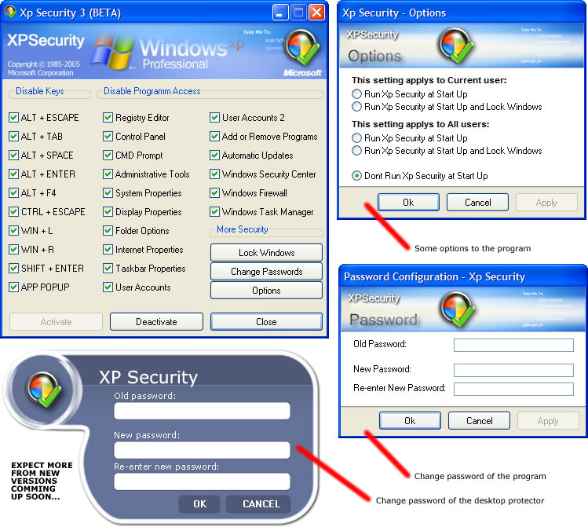



## Xp Security 3 \(BETA\)

### Description

Protect your Windows at anytime... the right ways... its password protected and it has ability to change passwords. both the desktop and program password... Next Version will have a fresh interface coz i am addin more stuff to it so that it doesnt look messy ;) comments/suggestions/votes are welcome.
 
### More Info
 

             |
---                |---
**Submitted On**   |2005-06-17 23:10:50
**By**             |[Jovica Mizdrak](https://github.com/Planet-Source-Code/PSCIndex/blob/master/ByAuthor/jovica-mizdrak.md)
**Level**          |Advanced
**User Rating**    |5.0 (45 globes from 9 users)
**Compatibility**  |VB 5\.0, VB 6\.0
**Category**       |[Coding Standards](https://github.com/Planet-Source-Code/PSCIndex/blob/master/ByCategory/coding-standards__1-43.md)
**World**          |[Visual Basic](https://github.com/Planet-Source-Code/PSCIndex/blob/master/ByWorld/visual-basic.md)
**Archive File**   |[Xp\_Securit1903006172005\.zip](https://github.com/Planet-Source-Code/jovica-mizdrak-xp-security-3-beta__1-61216/archive/master.zip)

